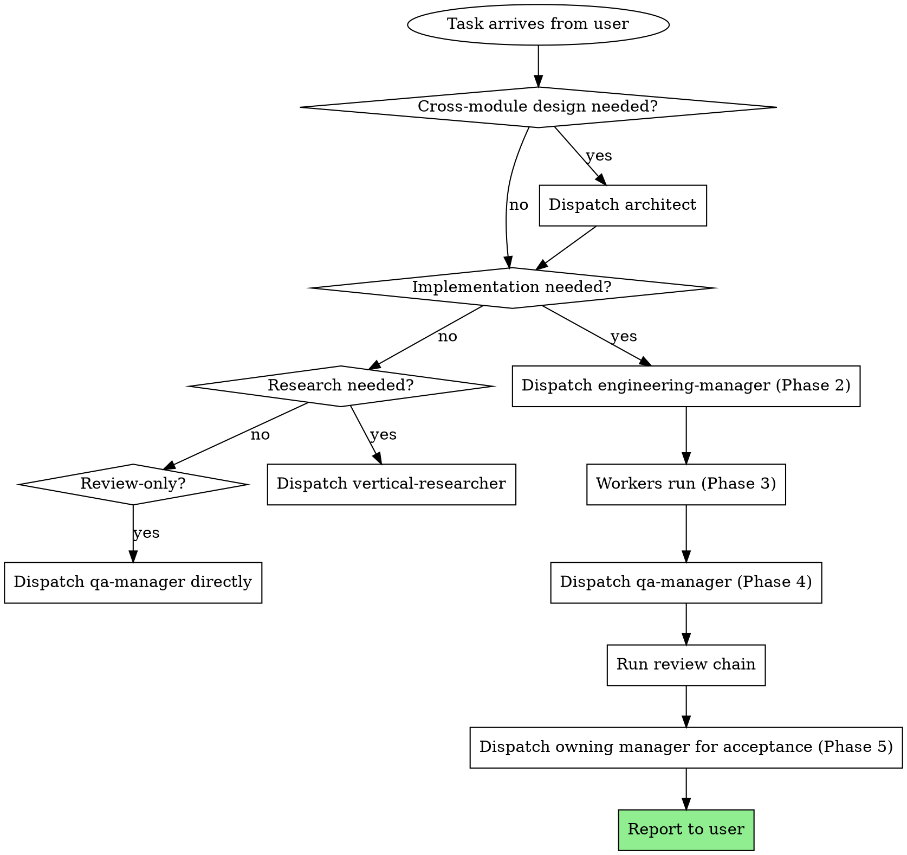

# Manager Delegation Pattern

## 1. The Constraint and Why This Skill Exists

**Subagents in Claude Code cannot dispatch other subagents.** A subagent that calls the `Task` tool fails — the tool is unavailable inside subagent context. This is a hard architectural fact, not a policy.

The implication for SUPER-MESHINE: even though the org chart says "engineering-manager owns the backend-builder", the **manager cannot actually launch the builder**. Only the CEO (the main Claude Code session in your terminal) holds the `Task` tool.

This skill exists because the natural mental model — "I'll ask the engineering-manager to handle this feature" — collapses against that constraint. If the CEO blindly forwards a feature brief to a manager and says "go", the manager will return a plan and stop. The workers never run, because the manager has no way to run them.

The fix is to **separate planning from dispatch**. Managers plan and adjudicate. The CEO is the literal dispatcher. This skill teaches the CEO how to honor the conceptual hierarchy (managers own their departments; workers report to managers) while doing all the dispatching itself.

**Core principle:** the CEO is a relay, not an authority. When a task arrives, the CEO consults the relevant manager for a plan, executes that plan by dispatching workers itself, then consults the manager again for acceptance. The manager never touches the `Task` tool, but every decision about *what to dispatch* and *whether the result is acceptable* is the manager's, not the CEO's.

## 2. The Org Chart

```
                       User (Ronen)
                            │ chat
                       CEO (main Claude session — invokes this skill)
                            │ Task dispatch (the ONLY dispatcher)
        ┌───────────────────┼───────────────────────────────────────────────┐
        │                   │                                               │
   architect          vertical-researcher          engineering-manager   qa-manager
   (Architecture     (Research Dept,              ──→ backend-builder    ──→ spec-reviewer
    Dept,             single-person)              ──→ frontend-builder   ──→ code-quality-reviewer
    single-person)                                                        ──→ erp-domain-expert
```

The `──→` arrows from managers to workers are **conceptual ownership**, not actual dispatch edges. The CEO is the only node with outgoing dispatch arrows. When the CEO dispatches `backend-builder`, it does so *on behalf of* `engineering-manager` and according to that manager's plan.

`architect` and `vertical-researcher` are single-person departments — they have no workers, so the CEO dispatches them directly without a planning round.

## 3. The 5-Phase Delegation Flow

For a typical feature implementation:

### Phase 1 — Routing (CEO decides which manager owns the task)

Read the task brief. Pick the owning manager:

- Task involves multi-module design, schema changes, or cross-cutting decisions? → **architect first**, then engineering-manager.
- Task is implementation only against an existing ADR or spec? → **engineering-manager**.
- Task is "review only" (audit existing code, check spec compliance, domain audit)? → **qa-manager**.
- Task is research or discovery (what does competitor X do, what does Priority's API look like)? → **vertical-researcher**.

Routing produces a single owning manager. Cross-cutting work runs architect first as a serial prefix, then routes to engineering-manager.

### Phase 2 — Planning (CEO dispatches the relevant manager)

Send the manager:
- The task brief (verbatim from user, or distilled if the user gave a long context).
- Pointers to relevant ADRs / vault notes / current state of code.
- Constraints from `CLAUDE.md` (Architecture Invariants).

The manager returns a **work plan** — a markdown file in `vault/Plans/<topic>.md` (or inline in the response if trivial) with:
- Numbered worker subtasks, each with: which worker agent, what context they need, what acceptance criteria apply.
- Dependencies between subtasks (which can run in parallel, which must serialize).
- A definition of "done" for the whole feature.

The manager does **not** write code in this phase. If the manager returns code instead of a plan, dispatch it again with a clearer instruction to plan only.

### Phase 3 — Execution (CEO dispatches workers per the manager's plan)

Read the manager's plan. For each worker subtask:
- If subtasks are independent, dispatch in parallel — see `dispatching-parallel-agents`.
- If subtasks are sequential, dispatch one at a time, feeding the previous output as context.
- If a worker returns `NEEDS_CONTEXT`, do **not** answer it yourself. Re-dispatch the manager with the worker's question, get the answer, then re-dispatch the worker.
- If a worker returns `BLOCKED`, escalate to the manager (re-dispatch with the blocker), and follow the manager's redirection.

The CEO never improvises worker subtasks that aren't in the manager's plan. If reality diverges from the plan, the CEO asks the manager to amend the plan.

### Phase 4 — Review (CEO dispatches qa-manager to plan and run the review chain)

After implementation completes — regardless of which manager owned the task — dispatch `qa-manager` with:
- The list of files changed.
- The commit SHAs (if any).
- The original task brief and the manager's plan.

`qa-manager` returns a **review chain plan**: which reviewers to run (always at minimum spec-reviewer → code-quality-reviewer; optionally erp-domain-expert if the change touches ERP business logic), in what order, and what each should focus on.

The CEO runs the chain:
1. Dispatch `spec-reviewer`. If it returns ❌ (spec gaps), dispatch the original worker (e.g., `backend-builder`) to fix, then re-dispatch `spec-reviewer`. Loop until ✅.
2. Dispatch `code-quality-reviewer`. Same loop.
3. If qa-manager's plan included `erp-domain-expert`, dispatch and loop.

### Phase 5 — Acceptance (CEO dispatches the owning manager for final accept)

Dispatch the owning manager (engineering-manager, or architect for cross-cutting work) with:
- Consolidated worker outputs.
- All reviewer adjudications from Phase 4.
- The original plan from Phase 2.

The manager returns one of:
- `DONE` — feature is accepted; CEO updates the vault Session Log and reports to user.
- `FIXES_NEEDED` — manager identifies remaining gaps; CEO loops back to Phase 3 with the manager's amended subtasks.

## 4. Decision Tree



## 5. Worked Example

**Task from user:** "Add an item-edit screen with inline editing for the items master table."

**Phase 1 — Routing (CEO):**
This is implementation against an existing schema (`items` table). No new cross-module design needed. Owning manager: `engineering-manager`. No architect prefix.

**Phase 2 — Planning (CEO dispatches engineering-manager):**
CEO sends: "Plan an item-edit screen with inline editing. Existing items schema in `vault/Architecture Decisions/items-schema.md`. Stack: Next.js + tRPC + Drizzle + shadcn/ui + TanStack Table. Honor Architecture Invariants (multi-tenancy, audit log)."

Engineering-manager returns `vault/Plans/item-edit-screen.md`:
1. `backend-builder`: tRPC mutation `items.update` with tenant_id check + audit_log write. Acceptance: passes test for cross-tenant rejection.
2. `frontend-builder`: TanStack Table with inline cell editing on item name + price. Optimistic update, rollback on mutation error. Acceptance: edit + save + reload reflects change.
3. (parallel with 2) `frontend-builder`: row-level error toast on validation failure.
Dependencies: 2 and 3 depend on 1. 2 and 3 can run in parallel.

**Phase 3 — Execution (CEO):**
- Dispatch `backend-builder` with subtask 1 verbatim. Returns `DONE`. Files: `src/server/routers/items.ts`, migration.
- Dispatch `frontend-builder` (subtask 2) and `frontend-builder` (subtask 3) **in parallel** per `dispatching-parallel-agents`. Both return `DONE`.

**Phase 4 — Review (CEO dispatches qa-manager):**
qa-manager returns chain: `spec-reviewer` → `code-quality-reviewer` → `erp-domain-expert` (because this touches an ERP master table).
- spec-reviewer: ❌ — "audit_log diff missing on price changes".
- CEO re-dispatches `backend-builder` to fix. → `DONE`. Re-dispatch spec-reviewer → ✅.
- code-quality-reviewer: ✅.
- erp-domain-expert: ✅ — "matches ERP master-data edit conventions".

**Phase 5 — Acceptance (CEO dispatches engineering-manager):**
Sends consolidated outputs + reviewer adjudications. engineering-manager returns `DONE`.

**CEO closing actions:** Update `vault/Meeting Notes/item-edit-screen.md` Session Log with `### 2026-05-07 — Item edit screen [shipped]`. Report to user.

## 6. When NOT to Use This Skill

- **Simple Q&A** ("what does this function do?", "where is X defined?"): just answer.
- **Pure research** ("what does competitor X charge for ERP?"): dispatch `vertical-researcher` and return its output. No managers needed.
- **Single-step trivial change** (typo in a doc, formatting fix, rename a constant in one file): CEO does it directly, then a one-line vault note. Phases 2-5 add overhead that exceeds the work.
- **Read-only architectural questions** ("how would we approach feature X if we built it?"): dispatch architect directly; no engineering-manager / qa-manager loop because nothing was implemented.

## 7. Anti-Patterns

1. **CEO dispatching workers without consulting the relevant manager first.** The CEO becomes a planner-by-improvisation. Workers do work that nobody owns. Reviews catch nothing because the spec was never written. → Always run Phase 2 before Phase 3.

2. **Managers attempting to dispatch other agents.** Impossible in Claude Code — the `Task` tool is unavailable inside subagents. If a manager's response includes phrases like "I will now dispatch backend-builder", treat it as a planning artifact, not an action. The CEO does the dispatch.

3. **Skipping qa-manager because "the change is small".** Small changes break invariants too — multi-tenancy regressions, missing audit_log entries, RBAC gaps. Phase 4 is mandatory for any code change. The cost (one extra subagent round) is dwarfed by the cost of shipping a tenant data leak.

4. **engineering-manager writing code instead of delegating.** The manager's job is plans + acceptance, not implementation. If the manager returns code, re-dispatch with "produce a plan only — workers will implement." Otherwise the CEO bypasses the worker layer and the spec-reviewer has no per-task spec to check against.

5. **Running review chain before implementation completes.** Dispatching spec-reviewer in parallel with the worker means spec-reviewer reviews a half-finished file. Phase 4 is strictly *after* every Phase 3 worker has returned `DONE`.

6. **CEO answering a worker's `NEEDS_CONTEXT` from its own context.** The worker is asking the *manager*, via the CEO. If the CEO answers based on session context, the answer might contradict the manager's plan or the architect's ADR. Always re-dispatch the manager with the question.

7. **Reusing a worker's subagent context across tasks.** Each Phase 3 dispatch is a fresh subagent. Don't try to "continue the conversation" — pack the context the worker needs into the dispatch message.

## 8. Integration With Other Skills

- **Required:** `subagent-driven-development` — defines the inner loop (implementer → spec-review → quality-review → fix → re-review). Phase 3 + Phase 4 of this skill *are* that loop, scaled up with manager planning bookends.
- **Required:** `dispatching-parallel-agents` — used in Phase 3 whenever the manager's plan marks subtasks as independent.
- **Required:** `obsidian-vault-workflow` — managers write their plans into `vault/Plans/<topic>.md` and the CEO updates `vault/Meeting Notes/<topic>.md` Session Log on each phase transition. Without this, the next session has no memory of what the manager planned.
- **Compatible:** `verification-before-completion` — managers reference this skill in the acceptance criteria they write into Phase 2 plans, so workers know they must run + click + verify before reporting `DONE`.
- **Compatible:** `finishing-a-development-branch` — invoked by the CEO after Phase 5 returns `DONE`, to handle vault update + commit + push as a unit.
