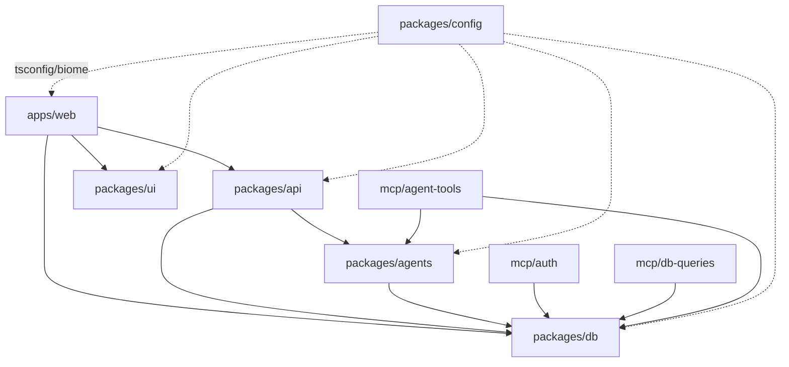

# ADR 004: Monorepo Structure

**Date:** 2026-05-07
**Status:** Proposed
**Decider:** Architect (proposed), CEO (final approval)

## Context

SUPER-MESHINE is a TypeScript stack (per ADR-003) deployed cloud-only on Vercel (founding decision D2), built by a solo/2-person team. While the MVP starts with a single Next.js app, the trajectory clearly includes multiple deployable surfaces (web customer UI, possibly admin, possibly mobile in future), shared multi-tenant DB schema (per ADR-002 — Postgres + RLS), shared product-side agent definitions, shared UI primitives, and internal MCP servers. We need to decide the repository layout *before* we write code, because retrofitting package boundaries later is significantly more painful than starting clean. The constraint is: **simplicity must beat flexibility** — at 1-2 developers, every minute spent fighting tooling is a minute not spent building. But we cannot ship a single-app codebase if we know within 6 months we'll need shared packages.

## Options Considered

### Option A: Turborepo + pnpm workspaces

A polyrepo-style layout inside one repo. `pnpm` handles dependency installation and workspace linking; `turbo` handles task orchestration, parallel builds, and remote caching. Vercel has first-class native support for Turborepo (auto-detected, remote cache linked to your team for free).

- **Pros:** Free remote cache on Vercel = builds in CI take seconds after warm cache. Native to the deploy target. Industry-standard for Next.js monorepos in 2026 — the "happy path" with the most documentation, recipes, and examples. `turbo run` makes pipelines (`build`, `test`, `lint`) trivially parallelizable with proper dep ordering. Easy onboarding for any future hire (they've seen this).
- **Cons:** One extra tool to learn (`turbo.json`, pipeline config). Adds ~30MB to `node_modules`. Caching can occasionally be confusing when it serves stale results.
- **Risk:** Low. Turborepo is owned by Vercel; if Vercel is alive, Turborepo is alive. Reversal cost is low — you can rip out `turbo` and keep `pnpm` workspaces in an afternoon.

### Option B: pnpm workspaces only (no Turborepo)

Same package layout, but task running uses `pnpm -r run <script>` and explicit `pnpm --filter` commands. No remote cache, no automatic dep-aware ordering.

- **Pros:** Simplest possible monorepo. One tool. Zero config beyond `pnpm-workspace.yaml`. Bulletproof — `pnpm` is the dependency manager either way. Easier mental model for solo dev: "it's just folders + `package.json`s".
- **Cons:** No remote build cache → CI builds all packages every time, even when only one changed. As the repo grows past ~5 packages, `pnpm -r build` ordering becomes a manual chore. No incremental task runner means `pnpm test` re-runs unchanged packages.
- **Risk:** Low. The pain shows up later, not earlier — and at that point adding Turborepo on top of an existing pnpm-workspaces repo is an afternoon's work, fully reversible. The risk is *opportunity cost*: spending 6 months waiting on slower CI before deciding to add the cache.

### Option C: Nx

Nx is the more powerful, more opinionated alternative. Better dep graph visualization, generators for new packages, more sophisticated affected-detection.

- **Pros:** Strongest tooling for very large monorepos. Built-in code generators. Excellent for enforcing strict module boundaries via `eslint-plugin-nx`.
- **Cons:** Significantly larger learning curve. More configuration files (`project.json` per package, `nx.json` root). Less native to Vercel — works fine but not the default path. Overkill for a 2-person team.
- **Risk:** Medium. Nx is opinionated; once you've adopted its conventions across many packages, migrating away is painful. Also: Nx's value proposition kicks in at 20+ packages — we'll have 6-8 for a long time.

### Option D: Single Next.js app, no monorepo

Keep everything in one `apps/` directory or no `apps/` at all — just a flat Next.js project. Defer monorepo decision until pain forces it.

- **Pros:** Maximum simplicity now. Zero workspace config. Fastest possible "git clone, npm install, npm dev".
- **Cons:** Forces premature coupling. The product agents (`packages/agents/`) and internal MCP servers (`mcp/`) are *inherently* deployable as separate processes — they don't belong inside `apps/web`. Shared DB schema between web and (future) admin app would have to be duplicated or extracted later under pressure. We *know* we'll need at least `packages/db` and `mcp/` from week 1.
- **Risk:** High. We've already identified ≥3 deploy targets in the founding context (web app, MCP servers, agent runners). Starting flat means an inevitable, painful extraction in 3-6 months — exactly the scenario architecting is meant to prevent.

## Trade-offs

| Criterion | A: Turbo + pnpm | B: pnpm only | C: Nx | D: Single app |
|---|---|---|---|---|
| Setup simplicity (day 1) | ⚠️ | ✅ | ❌ | ✅ |
| CI speed at 6 packages | ✅ | ⚠️ | ✅ | ✅ (only 1 build) |
| Vercel native integration | ✅ | ✅ | ⚠️ | ✅ |
| Reversal cost | ✅ | ✅ | ❌ | ❌ (forces extraction) |
| Fit for 1-2 person team | ✅ | ✅ | ❌ | ✅ |
| Supports multi-deploy from day 1 | ✅ | ✅ | ✅ | ❌ |
| Industry mind-share / docs | ✅ | ✅ | ⚠️ | ✅ |
| Enforces module boundaries | ⚠️ | ⚠️ | ✅ | ❌ |

## Decision

**Option A: Turborepo + pnpm workspaces.**

This is the lowest-risk choice that matches the deploy target (Vercel) and the known shape of the system (multi-package, multi-deploy from day 1). The Turborepo overhead is small and front-loaded — one `turbo.json`, one afternoon of learning — in exchange for a free remote cache and dep-aware task orchestration that pays off every CI run forever. Option B is genuinely tempting for a solo dev, but the additional friction of adding Turborepo *later* (configuring pipelines retroactively, debugging cache misses on a live codebase) is higher than configuring it once at the start. Option C is over-engineered for our scale. Option D is rejected because we have *already identified* packages that must be separately deployable (`mcp/`, eventually `packages/agents/`); starting flat is a known dead-end.

This decision will be **wrong** if: (a) we end up never building a second app or shared package and the monorepo is pure overhead — but ADR-002's RLS + multi-tenant design and the planned MCP servers make this nearly impossible; (b) Vercel deprecates first-class Turborepo support — extremely unlikely given they own it.

## Consequences

- **Positive:**
  - Single `pnpm install` bootstraps the entire dev environment.
  - Free Vercel remote cache → CI builds in seconds for unchanged packages.
  - Clear physical boundaries between deploy targets (web app, MCP servers) from day 1 — prevents the "everything imports everything" anti-pattern.
  - Shared types in `packages/db` mean a schema change surfaces as a TS error in `apps/web` immediately, before runtime.
  - New developer onboarding: `git clone && pnpm install && pnpm dev`. That's it.

- **Negative / technical debt:**
  - Two tools instead of one (`pnpm` + `turbo`). Solo dev must learn `turbo.json` syntax (~30 min one-time).
  - Slightly larger `node_modules` footprint.
  - Internal package versioning: we use `workspace:*` for all internal deps, meaning we explicitly do **not** publish to npm or use Changesets initially. If we later need to publish anything, that's a separate (small) decision.
  - Risk of cache invalidation bugs (~once a quarter someone runs `turbo run build --force` to bust a stale cache).

- **Impact on other modules:**
  - **ADR-002 (multi-tenant RLS):** `packages/db` becomes the single home for the Drizzle schema, RLS helpers, and per-entity query functions. All other packages import from `@super-meshine/db`. This is the strongest enforcement we can give to "all DB access goes through the RLS-aware helpers."
  - **ADR-003 (TypeScript stack):** `packages/config` provides the shared `tsconfig.base.json` so every package has identical `strict: true`, identical path resolution, identical lib targets.
  - **Future agents work:** `packages/agents/` (product-side Claude Agent SDK definitions for Procurement Agent, Copilot, etc.) lives separately from `.claude/agents/` (this dev-side architect/builder coordination). Same SDK, totally different concern.
  - **MCP servers:** `mcp/` is a top-level directory (not under `packages/`) because MCP servers are deployable processes, not libraries. They consume `packages/db`, `packages/agents`, etc.

## Reversal Conditions

We will revisit this ADR if:

1. **(Most important)** The repo grows past ~10 packages AND we find ourselves regularly fighting Turborepo's caching or task graph — at that point Nx (Option C) becomes worth its complexity cost. **This is the most important reversal condition** because it's the only realistic scenario where we'd need to migrate to a fundamentally different tool, and migrating Nx-into-existing-monorepo is the most painful of all the migration paths.
2. Vercel deprecates or significantly changes Turborepo support.
3. We hit the boundary where one of the `packages/*` genuinely needs to be a separately-published npm package (e.g., open-sourcing `packages/ui`) — at which point we add Changesets, but stay on Turborepo.
4. The 2-person team grows to 6+ engineers and we need stricter module-boundary enforcement than Turborepo provides natively (consider `eslint-plugin-boundaries` or migrating to Nx).
5. CI build times exceed 10 minutes despite cache hits — would indicate a deeper architecture issue, not a tooling issue.

## Implementation Notes

### Package layout

```
super-meshine/
├── apps/
│   └── web/                    # Next.js 15 App Router, customer-facing UI
│       ├── app/
│       ├── package.json
│       └── next.config.ts
├── packages/
│   ├── db/                     # Drizzle schema, migrations, RLS helpers, query functions
│   │   ├── src/
│   │   │   ├── schema/         # tables per domain (items, suppliers, ...)
│   │   │   ├── migrations/     # drizzle-kit generated SQL
│   │   │   ├── rls/            # tenant-scoped client factory
│   │   │   └── queries/        # typed query functions per entity
│   │   └── package.json
│   ├── api/                    # tRPC router + business logic
│   │   ├── src/
│   │   │   ├── routers/
│   │   │   ├── trpc.ts
│   │   │   └── context.ts
│   │   └── package.json
│   ├── agents/                 # Product-side Claude Agent SDK definitions
│   │   ├── src/
│   │   │   ├── procurement/
│   │   │   ├── copilot/
│   │   │   └── shared/
│   │   └── package.json
│   ├── ui/                     # shadcn/ui components, Tailwind preset, design tokens
│   │   ├── src/
│   │   │   ├── components/
│   │   │   └── tailwind.preset.ts
│   │   └── package.json
│   └── config/                 # shared tsconfig, biome config, eslint base
│       ├── tsconfig.base.json
│       ├── biome.base.json
│       └── package.json
├── mcp/                        # Internal MCP servers (separately deployable)
│   ├── auth/
│   ├── db-queries/
│   └── agent-tools/
├── package.json                # root, private, workspaces declared
├── pnpm-workspace.yaml
├── turbo.json
├── tsconfig.json               # extends packages/config/tsconfig.base.json
├── biome.json                  # extends packages/config/biome.base.json
└── .nvmrc
```

### Decision: tRPC location

`packages/api` is its **own package**, not `apps/web/app/api`. Reason: the same tRPC router is consumed by (a) the Next.js app's API route handlers, (b) future admin app, (c) potentially MCP servers exposing operations to product agents. Keeping it in `apps/web` would force duplication. The Next.js side is just a thin adapter: `apps/web/app/api/trpc/[trpc]/route.ts` imports the router from `@super-meshine/api`.

### Decision: shared types — `packages/types` or co-located?

**Co-located, no separate `packages/types`.** Zod schemas live next to the code that owns them: DB schemas in `packages/db`, API input/output schemas in `packages/api`. A separate types package becomes a dumping ground that everything imports from, defeating the purpose of package boundaries. If a type is genuinely cross-cutting (e.g., `TenantId` branded type), it lives in `packages/db` and is re-exported as needed.

### Dependency graph



**Rule:** dependencies flow upward (apps depend on packages, never the reverse). `packages/db` is a leaf — it depends only on Drizzle and Zod. `packages/config` is a peer-dependency provider for tooling, not a runtime dep.

### Root `package.json`

```json
{
  "name": "super-meshine",
  "private": true,
  "version": "0.0.0",
  "packageManager": "pnpm@9.12.0",
  "engines": {
    "node": ">=20.11.0",
    "pnpm": ">=9.0.0"
  },
  "scripts": {
    "dev": "turbo run dev --parallel",
    "build": "turbo run build",
    "test": "turbo run test",
    "lint": "turbo run lint",
    "format": "biome format --write .",
    "typecheck": "turbo run typecheck",
    "clean": "turbo run clean && rm -rf node_modules"
  },
  "devDependencies": {
    "turbo": "^2.3.0",
    "@biomejs/biome": "^1.9.0",
    "typescript": "^5.6.0"
  }
}
```

### `pnpm-workspace.yaml`

```yaml
packages:
  - "apps/*"
  - "packages/*"
  - "mcp/*"
```

### `turbo.json`

```json
{
  "$schema": "https://turbo.build/schema.json",
  "globalDependencies": ["**/.env.*local", "tsconfig.json", "biome.json"],
  "globalEnv": ["NODE_ENV", "VERCEL_ENV"],
  "tasks": {
    "build": {
      "dependsOn": ["^build"],
      "outputs": [".next/**", "!.next/cache/**", "dist/**"],
      "env": ["DATABASE_URL", "NEXT_PUBLIC_*"]
    },
    "dev": {
      "cache": false,
      "persistent": true,
      "dependsOn": ["^build"]
    },
    "test": {
      "dependsOn": ["^build"],
      "outputs": ["coverage/**"]
    },
    "lint": {
      "outputs": []
    },
    "typecheck": {
      "dependsOn": ["^build"],
      "outputs": []
    },
    "clean": {
      "cache": false
    },
    "db:migrate": {
      "cache": false,
      "env": ["DATABASE_URL"]
    },
    "db:generate": {
      "outputs": ["src/migrations/**"]
    }
  }
}
```

### Internal package naming

All internal packages use the scope `@super-meshine/<name>`. Internal deps are pinned via `workspace:*` (not real semver, not published to npm).

Example `packages/api/package.json`:

```json
{
  "name": "@super-meshine/api",
  "version": "0.0.0",
  "private": true,
  "main": "./src/index.ts",
  "types": "./src/index.ts",
  "scripts": {
    "build": "tsc -b",
    "test": "vitest run",
    "lint": "biome check .",
    "typecheck": "tsc --noEmit"
  },
  "dependencies": {
    "@super-meshine/db": "workspace:*",
    "@super-meshine/agents": "workspace:*",
    "@trpc/server": "^11.0.0",
    "zod": "^3.23.0"
  },
  "devDependencies": {
    "@super-meshine/config": "workspace:*"
  }
}
```

### Vercel deployment

- `apps/web` is the only Vercel project at MVP. Set the project's "Root Directory" to `apps/web` in the Vercel dashboard. Vercel auto-detects the Turborepo and links the remote cache to the team account (free).
- `mcp/*` deploys are deferred — they may run as Vercel functions, separate Node services, or Cloudflare Workers. Decision deferred to a separate ADR when the first MCP server is needed in production.

### What `apps/web` is NOT allowed to import

- Anything from `mcp/*` (those are independent processes, not libraries).
- Internal helpers from another `apps/*` (when admin app exists later).
- Migration files from `packages/db` (only the schema and query layer).

These rules will be enforced by `tsconfig` path restrictions in `packages/config/tsconfig.base.json` and (later, if needed) a custom Biome lint rule.
